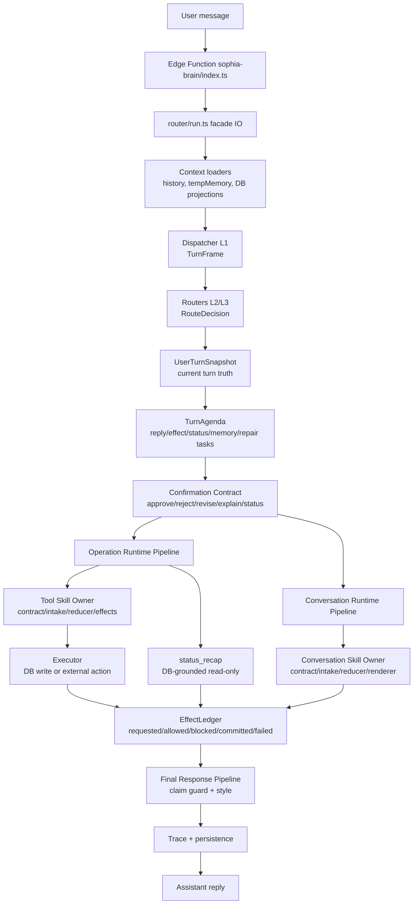
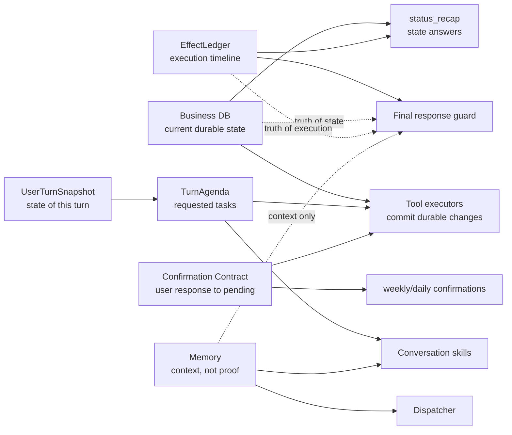
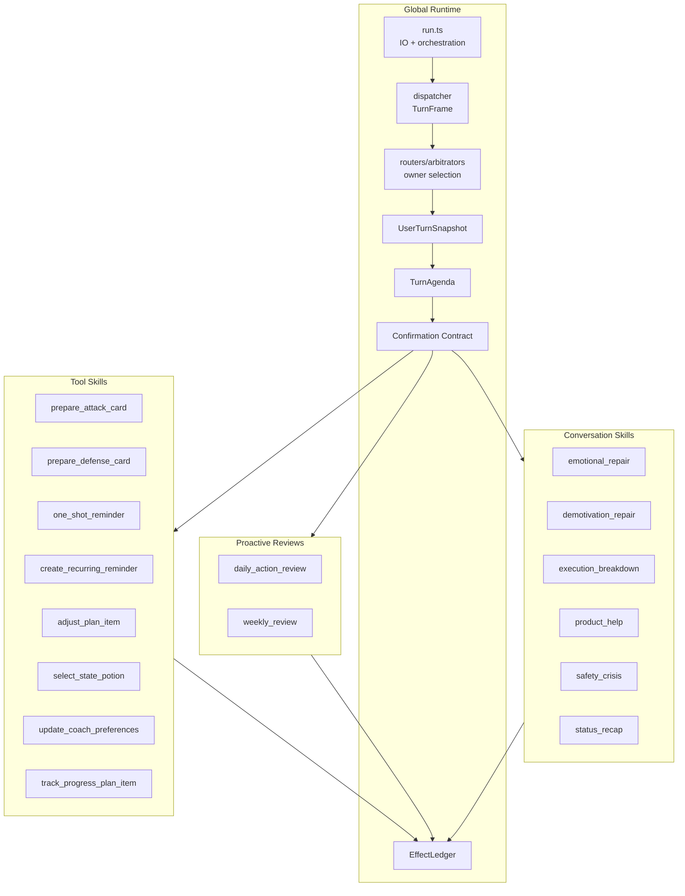
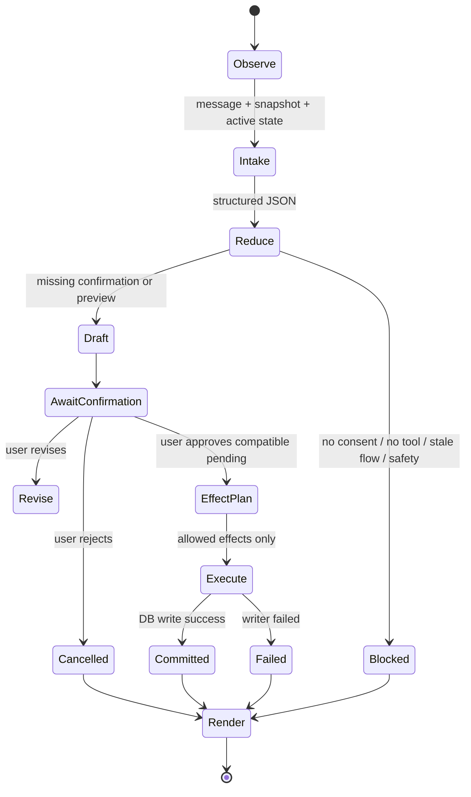
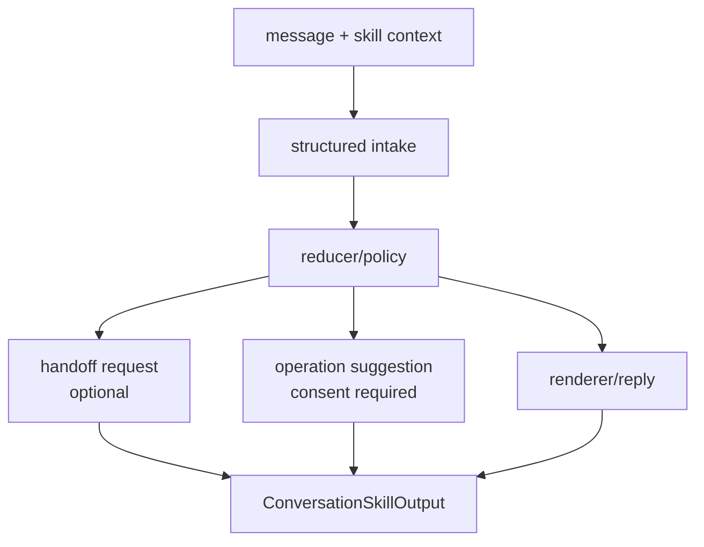
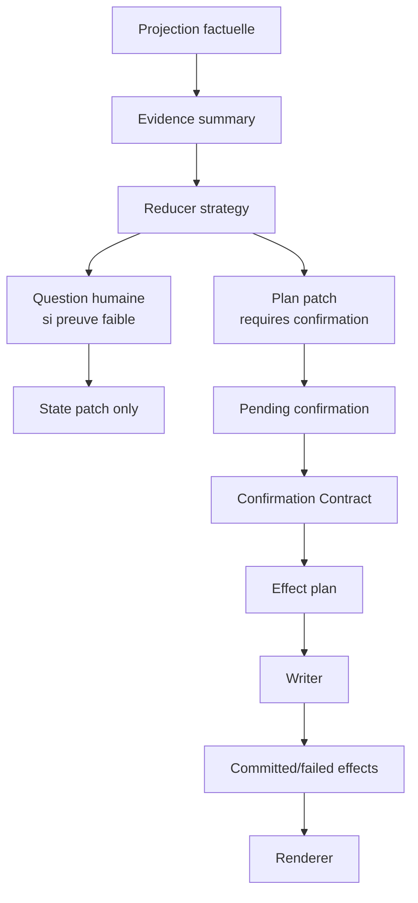
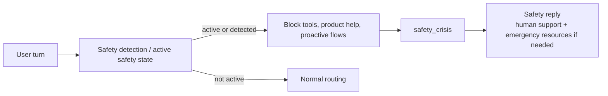

# Sophia Brain Runtime Diagram

## Mental Model

Ce document donne la vue système de Sophia Brain. Il ne remplace pas les
contrats de domaine : il montre où chaque instance intervient, quelle vérité
elle possède, et quelles frontières elle ne doit pas franchir.

## Vue Globale D'Un Tour

## Vérités Du Système

Règles :

- DB métier = vérité d'état actuel.
- EffectLedger = vérité d'exécution observée.
- UserTurnSnapshot = vérité du tour courant.
- TurnAgenda = vérité des tâches demandées par le tour.
- Confirmation Contract = vérité de ce que le user vient d'approuver, refuser,
  modifier, demander en preview/status ou rendre ambigu.
- Memory = contexte utile, jamais preuve d'existence.

## Ownership Par Instance

Chaque bloc local est propriétaire de son contrat. Le runtime global ne doit
pas connaître les détails internes comme `draft_only`, `mode_tunnel`,
`target_binding`, `potion_type`, `weekly_patch`, ou les slots d'une carte.

## Cycle D'Un Tool Skill

Règles :

- `Draft` ne peut pas écrire en DB.
- `AwaitConfirmation` n'exécute rien sans pending compatible.
- `EffectPlan` doit exposer allowed/blocked effects.
- `Execute` est le seul endroit où l'écriture durable est autorisée.
- `Render` parle à partir de `committed`, `failed` ou `blocked`.

## Cycle D'Un Conversation Skill

Un conversation skill peut :

- stabiliser;
- expliquer;
- produire une phrase;
- suggérer un tool avec consentement;
- demander un handoff.

Il ne peut pas :

- écrire en DB;
- créer/annuler/modifier un objet;
- marquer un effet comme committé;
- dire qu'une opération est faite.

## Cycle Daily / Weekly

Daily collecte des preuves légères. Weekly décide une stratégie hebdomadaire à
partir des preuves, mais ne modifie rien sans confirmation et writer success.

## Safety Priority

Safety est prioritaire sur tous les autres owners. Aucun tool, plan, potion,
rappel, product help ou préférence coach ne doit s'exécuter pendant une crise.

## Où Lire Ensuite

- Doctrine : `00-architecture-doctrine.md`
- Runtime global : `01-global-runtime.md`
- `run.ts` mince : `02-run-thin-orchestrator.md`
- Snapshot/agenda : `03-user-turn-snapshot-agenda.md`
- Confirmation : `04-confirmation-contract.md`
- EffectLedger : `05-effect-ledger.md`
- Contrats locaux : `tools/*`, `conversation-skills/*`, `proactive/*`

## Suivi Des Décisions Architecturales

| Date | Décision | Statut | Référence |
| --- | --- | --- | --- |
| 2026-05-30 | Ajouter une carte système détaillée des instances Sophia Brain dans `runtime-contracts`. | Active | J59 |
| 2026-05-30 | Séparer les vérités DB, EffectLedger, TurnAgenda, Confirmation Contract et Memory. | Active | `00-architecture-doctrine.md` |
