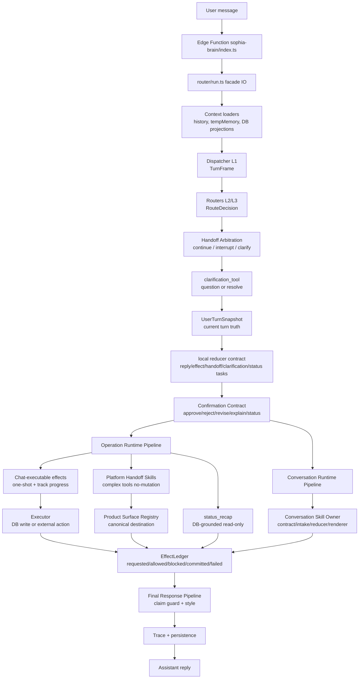
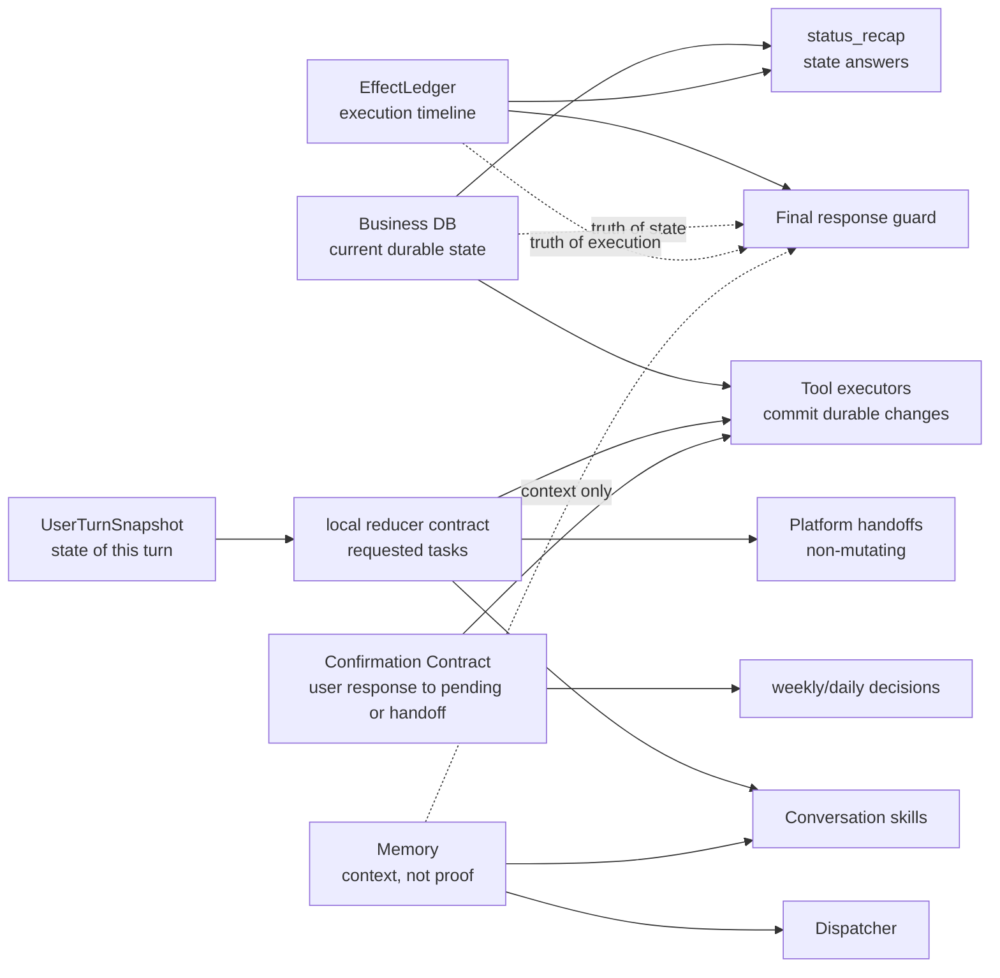
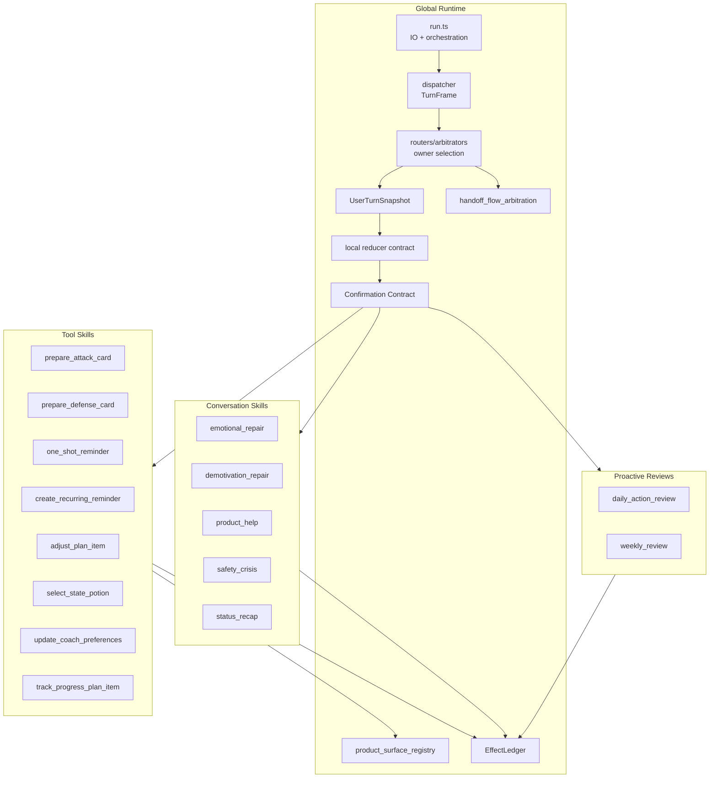
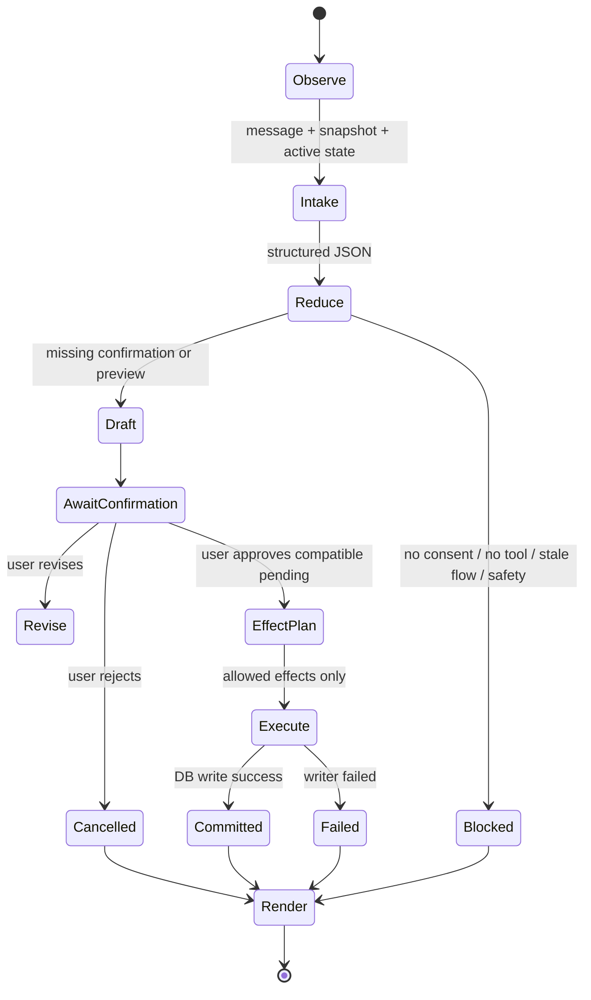
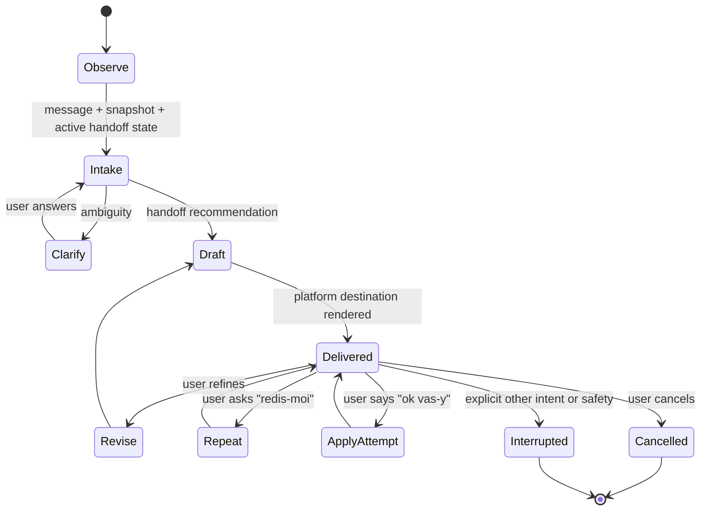
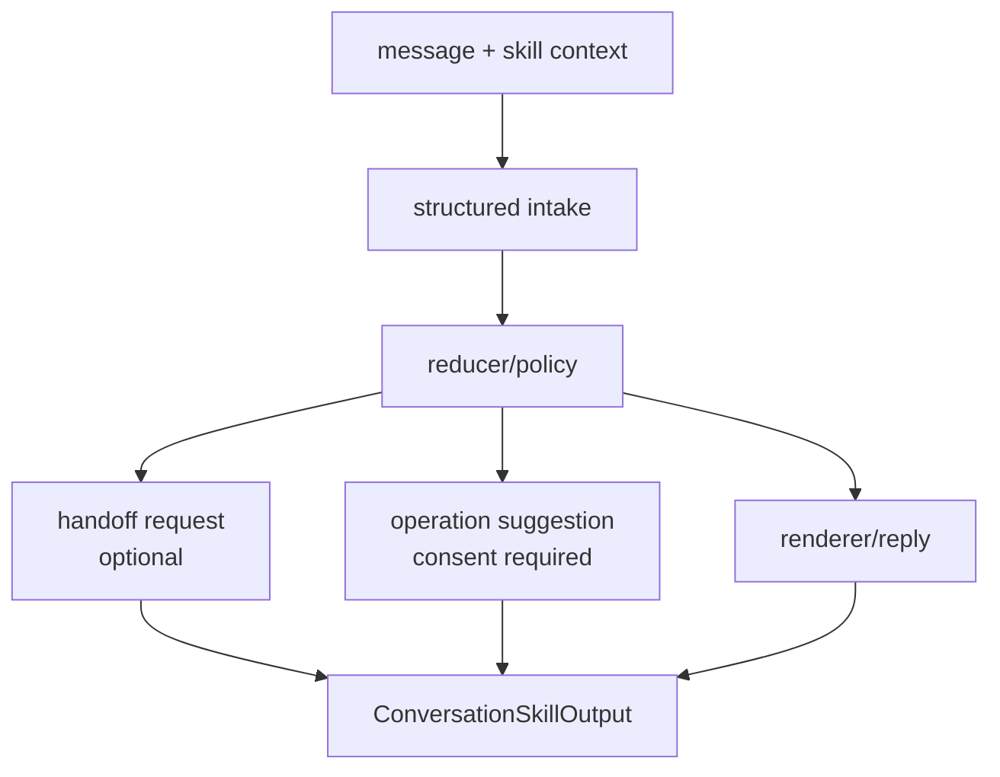
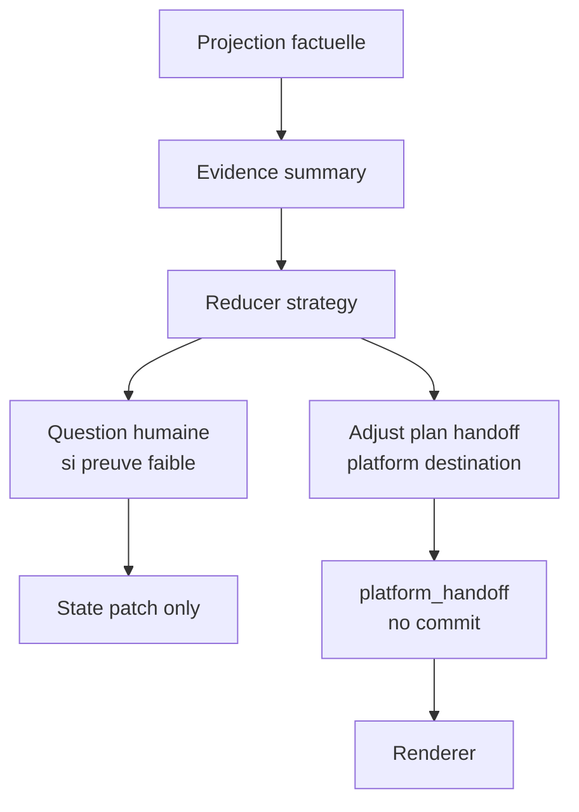
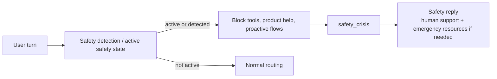

# Sophia Brain Runtime Diagram

## Mental Model

Ce document donne la vue système de Sophia Brain. Il ne remplace pas les
contrats de domaine : il montre où chaque instance intervient, quelle vérité
elle possède, et quelles frontières elle ne doit pas franchir.

## Vue Globale D'Un Tour

## Vérités Du Système

Règles :

- DB métier = vérité d'état actuel.
- EffectLedger = vérité d'exécution observée.
- UserTurnSnapshot = vérité du tour courant.
- local reducer contract = vérité des tâches demandées par le tour.
- Confirmation Contract = vérité de ce que le user vient d'approuver, refuser,
  modifier, demander en preview/status ou rendre ambigu.
- Product Surface Registry = vérité des destinations de handoff.
- Platform handoff = résultat conversationnel non-mutant, jamais preuve d'état
  ni commit.
- Memory = contexte utile, jamais preuve d'existence.

## Ownership Par Instance

Chaque bloc local est propriétaire de son contrat. Le runtime global ne doit
pas connaître les détails internes comme `draft_only`, `mode_tunnel`,
`target_binding`, `potion_type`, `weekly_patch`, ou les slots d'une carte.

## Cycle D'Un Tool Skill

Règles :

- `Draft` ne peut pas écrire en DB.
- `AwaitConfirmation` n'exécute rien sans pending compatible.
- `EffectPlan` doit exposer allowed/blocked effects.
- `Execute` est le seul endroit où l'écriture durable est autorisée.
- `Render` parle à partir de `committed`, `failed` ou `blocked`.

Ce cycle reste valide pour les effets chat exécutables et les domaines durables
qui possèdent encore un executor. En V1 chat, seuls `create_one_shot_reminder`
et `track_progress_plan_item` restent mutatifs nominaux.

## Cycle D'Un Platform Handoff Skill

Règles :

- Aucun executor.
- Aucun writer DB.
- Aucun pending confirmation exécutable.
- `ApplyAttempt` refuse l'exécution chat et redonne la destination plateforme.
- `Delivered` est un succès conversationnel non-mutant.
- La destination vient du Product Surface Registry.

## Cycle D'Un Conversation Skill

Un conversation skill peut :

- stabiliser;
- expliquer;
- produire une phrase;
- suggérer un handoff avec consentement;
- demander clarification.

Il ne peut pas :

- écrire en DB;
- créer/annuler/modifier un objet;
- marquer un effet comme committé;
- dire qu'une opération est faite.

## Cycle Daily / Weekly

Daily collecte des preuves légères. Weekly décide une stratégie hebdomadaire à
partir des preuves. Pour V1 chat, les ajustements de plan sortent en handoff
plateforme; weekly ne modifie pas le plan depuis le chat.

## Safety Priority

Safety est prioritaire sur tous les autres owners. Aucun tool, plan, potion,
rappel, product help, préférence coach ou handoff produit ne doit s'exécuter ou
être proposé pendant une crise.

## Où Lire Ensuite

- Doctrine : `00-architecture-doctrine.md`
- Runtime global : `01-global-runtime.md`
- `run.ts` mince : `02-run-thin-orchestrator.md`
- Snapshot de tour : `03-user-turn-snapshot.md`
- Confirmation : `04-confirmation-contract.md`
- EffectLedger : `05-effect-ledger.md`
- Active handoff arbitration : `07-active-handoff-arbitration.md`
- Product Surface Registry : `08-product-surface-registry.md`
- Contrats locaux : `tools/*`, `conversation-skills/*`, `proactive/*`

## Suivi Des Décisions Architecturales

| Date | Décision | Statut | Référence |
| --- | --- | --- | --- |
| 2026-05-30 | Ajouter une carte système détaillée des instances Sophia Brain dans `runtime-contracts`. | Active | J59 |
| 2026-05-30 | Séparer les vérités DB, EffectLedger, local reducer contract, Confirmation Contract et Memory. | Active | `00-architecture-doctrine.md` |
| 2026-06-01 | Ajouter la vue `platform_handoff_skill` : complex tools no-mutation, Product Surface Registry et active handoff arbitration. | Active | Architecture handoff V1 |
