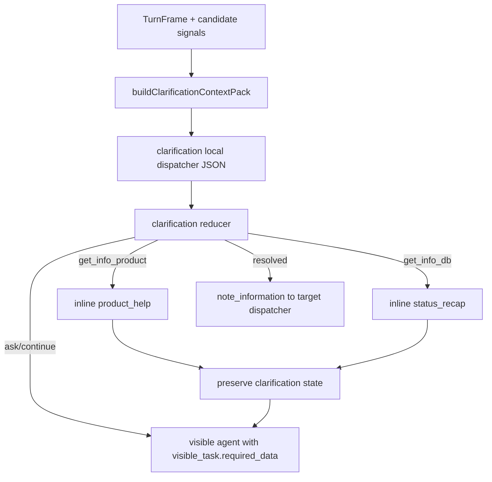

# Clarification Local Flow Dynamic Context Plan

## Goal

Mettre a jour le flow local `clarification` pour qu'il fonctionne comme un vrai
flow d'arbitrage agile :

- il arbitre entre des candidats deja produits par les dispatchers/signaux ;
- il n'invente pas de nouveau candidat ;
- il injecte le contexte DB utile selon les familles candidates presentes ;
- il transmet des donnees dynamiques au prompt visible local via
  `visible_task.required_data` ;
- il peut appeler `product_help` ou `status_recap` en inline quand le user pose
  une question produit ou DB pendant la clarification ;
- il revient ensuite au choix initial sans fermer le flow ;
- il prepare une `note_information` exploitable pour le dispatcher cible quand
  la clarification est resolue.

## Non Goals

Ce chantier ne traite pas le contrat global de style conversationnel
`VISIBLE_OUTPUT_STYLE_RULES`. Le tutoiement/concision global sera traite dans un
chantier separe.

Ce chantier ne doit pas ajouter une matrice rigide de combinaisons du type
`attack_vs_defense`, `attack_vs_adjust_plan`, etc. La structure doit rester
agile : les adapters de contexte sont composes par famille candidate, pas par
case predefinie.

Ce chantier ne doit pas donner a `clarification` les moyens d'executer un tool
metier. Les appels inline `product_help` et `status_recap` sont des roundtrips
read-only/conversationnels qui preservent le flow parent.

## Current Issues

1. Le local dispatcher de clarification a deja des actions
   `get_info_product` et `get_info_db`, mais le runtime ne les traite pas encore
   comme un vrai roundtrip inline comparable a `prepare_attack_card`.

2. Le contexte DB utile n'est pas construit dynamiquement selon les candidats.
   Exemple : si les signaux hesitent entre `prepare_attack_card` et
   `adjust_plan_item`, clarification devrait recevoir les cartes d'attaque
   pertinentes et les actions actives du plan.

3. Le `known_context` enrichi n'est pas garanti jusqu'a la
   `note_information`.

4. Le prompt visible peut recevoir un `visible_task.kind`, mais le contrat
   `required_data` n'est pas assez riche pour produire une question ciblee qui
   fait avancer le flow.

5. Le JSON LLM de clarification contient trop de bruit runtime, notamment
   `no_chat_mutation`. Comme clarification ne recoit pas les moyens d'executer
   des tools metier, cette garantie doit rester cote runtime/tests, pas dans le
   JSON demande au dispatcher.

## Target Architecture



The important contract is:

```text
local dispatcher -> visible_task.required_data -> visible prompt
```

The dispatcher must not only choose `visible_task.kind`; it must also pass the
right dynamic information for that visible prompt to ask a useful question.

## Target Dispatcher Output

The local dispatcher should return a compact JSON shape:

```ts
{
  flow_action:
    | "ask_disambiguation"
    | "still_ambiguous"
    | "revise_understanding"
    | "explain_candidate_options"
    | "get_info_product"
    | "get_info_db"
    | "resolved_to_candidate"
    | "cancel_clarification"
    | "exit_to_global_dispatcher"
    | "safety_preempt";

  confidence: "low" | "medium" | "high";
  risk_score: number;

  clarification_state: {
    clarification_id: string;
    status:
      | "asking"
      | "resolved"
      | "still_ambiguous"
      | "cancelled"
      | "topic_change"
      | "safety";
    source_dispatcher: "global" | "local";
    source_flow_id: string | null;
    ambiguity_kind: "intent" | "target" | "scope" | "surface" | "timing" | "confirmation" | "handoff_readiness";
    ambiguity_axes: Array<"intent" | "target" | "scope" | "surface" | "timing" | "confirmation" | "handoff_readiness">;
    conflict_summary: string;
    candidate_signals: ClarificationCandidateSignal[];
    selected_candidate_id: string | null;
    selected_candidate_label: string | null;
    why_selected_or_not: string;
    turn_count: number;
  };

  inline_info: {
    requested: boolean;
    kind: "product" | "db" | null;
    question_to_answer: string | null;
    resume_clarification_goal: string | null;
    object_types?: Array<"attack_card" | "defense_card" | "recurring_reminder" | "plan_item">;
  };

  visible_task: ClarificationVisibleTask;

  note_information: {
    needed: boolean;
    source_flow_id: "clarification";
    source_flow_presentation: string;
    handoff_reason: "clarification_resolved" | "topic_change" | "safety" | "inline_tool" | "none";
    target_dispatcher: string | null;
    handoff_context_for_next_dispatcher: string | null;
    target_local_dispatcher_hint: string | null;
    structured_context: Record<string, unknown>;
  };

  evidence: string[];
}
```

`no_chat_mutation` must not be requested from the LLM output. If runtime traces
still need mutation flags, they should be derived by the reducer/runtime, not by
the clarification dispatcher.

## Dynamic Visible Task Contract

`visible_task.required_data` is the transmission layer from the local dispatcher
to the local conversation prompt.

Target shape:

```ts
{
  question_goal: string;
  conflict_summary: string;
  candidate_labels: string[];
  selected_candidate_label: string | null;

  known_references: Array<{
    type:
      | "active_plan_item"
      | "attack_card"
      | "defense_card"
      | "recurring_reminder"
      | "product_concept"
      | "unknown";
    id?: string;
    label: string;
    status?: string;
    why_relevant?: string;
  }>;

  best_reference_guess: {
    type: string;
    id?: string;
    label: string;
    confidence: "low" | "medium" | "high";
    evidence: string[];
  } | null;

  missing_decision: {
    kind:
      | "choose_direction"
      | "identify_target"
      | "confirm_target"
      | "understand_product_concept"
      | "answer_db_status"
      | "confirm_handoff";
    description: string;
  } | null;

  question_constraints: {
    max_questions: 1;
    should_confirm_guess: boolean;
    should_offer_options: boolean;
    must_not_list_all_references: boolean;
    must_not_explain_internals: true;
  };

  question: string | null;
}
```

The visible agent must not infer missing business context from scratch. It
should write from this structured data.

## Visible Task Kinds

Use generic but useful visible stages:

- `ask_choice`: ask the user to choose between plausible directions.
- `ask_target_reference`: identify the object/action/reminder/card being
  referenced.
- `confirm_candidate`: confirm a likely candidate or likely target.
- `explain_options`: explain the difference between options using only the
  candidate descriptions and provided context.
- `inline_info_return`: after an inline product/DB answer, bring the user back
  to the original clarification goal.
- `resolved_transition`: short transition after the choice is resolved.
- `repeat_question`: rephrase a previous clarification question.
- `stop_or_cancel`: close the clarification locally.
- `exit_ack`: hand off a clear topic change.
- `safety`: stop clarification for safety ownership.

## Context Pack

Create:

```text
supabase/functions/sophia-brain/clarification/context_pack.ts
```

The context pack is built by candidate family adapters, not by hardcoded
candidate combinations.

Target shape:

```ts
{
  version: "clarification_context_pack_v1";
  loaded_for_candidate_operations: string[];
  projections: {
    active_plan_items: Array<Record<string, unknown>>;
    attack_cards: Array<Record<string, unknown>>;
    defense_cards: Array<Record<string, unknown>>;
    recurring_reminders: Array<Record<string, unknown>>;
  };
  retrieval_notes: string[];
  limits: {
    max_items_per_category: number;
  };
}
```

Adapter rules:

- `prepare_attack_card` loads attack cards and active plan items.
- `prepare_defense_card` loads defense cards and active plan items.
- `adjust_plan_item` loads active plan items.
- `create_recurring_reminder` loads active recurring reminders and active plan
  items.

If several candidate families are present, use the union of required adapters.

The projections must stay compact. Include fields such as `id`, `title`,
`status`, `kind`, relevant linkage ids, and timestamps when useful. Do not pass
large raw table rows.

Partial DB errors must not crash clarification. Add a `retrieval_notes` entry
and continue with the available context.

## Inline Info Roundtrip

Clarification must support two inline paths:

### Product Explanation

Use `get_info_product` when the user asks:

- "c'est quoi X ?";
- "a quoi ca sert ?";
- "quelle est la difference entre X et Y ?";
- "ou je retrouve ca ?";
- "comment ca marche ?"

Runtime must call `runInlineGetInfoProductTool` with:

```ts
{
  active_flow: "clarification",
  active_flow_status: "asking",
  question_to_answer,
  active_flow_context: {
    conflict_summary,
    candidate_signals,
    clarification_context_pack,
    resume_clarification_goal
  },
  dispatcher_context: note_information
}
```

### DB/Status Explanation

Use `get_info_db` when the user asks:

- "j'en ai deja une ?";
- "quel rappel est actif ?";
- "quelle action est prevue demain ?";
- "est-ce que cette carte existe deja ?";

Runtime must call `runInlineGetInfoDbTool`.

Map candidate operations to `status_recap` object types:

- `prepare_attack_card` -> `attack_card`
- `prepare_defense_card` -> `defense_card`
- `create_recurring_reminder` -> `recurring_reminder`
- `adjust_plan_item` -> `plan_item`

After inline answer:

- keep clarification local state active;
- store a compact inline subskill history in state or `known_context`;
- return the inline answer to the user;
- do not run global dispatcher or tool-skill execution on that same turn.

## Note Information

When clarification resolves to a candidate, the reducer must include the dynamic
context in `note_information.structured_context`:

```ts
{
  clarification_id,
  clarification_task_kind,
  selected_candidate_id,
  selected_candidate_label,
  candidate_signals,
  selected_candidate_payload_hint,
  clarification_context_pack,
  context_evidence_used,
  best_reference_guess,
  missing_for_target_dispatcher,
  dispatcher_structured_context
}
```

The target dispatcher must treat this as source context, not as a deterministic
instruction to mutate or fill final slots.

## File-by-File Implementation Plan

### 1. `clarification/contract.ts`

- Remove `no_chat_mutation` from `ClarificationLocalDispatcherOutput`.
- Add `ambiguity_axes` to `clarification_state`.
- Replace or normalize `inline_tool` into `inline_info`.
- Expand `ClarificationVisibleTaskKind`.
- Expand `ClarificationVisibleTask.required_data` with dynamic context fields.
- Keep compatibility types if needed during migration, but normalize internally
  to the new shape.

### 2. `clarification/context_pack.ts`

- Add context pack types.
- Add `buildClarificationContextPack`.
- Add small projection helpers for:
  - active plan items;
  - attack cards;
  - defense cards;
  - recurring reminders.
- Add adapter selection from candidate operations.
- Add compact row normalizers.

### 3. `router/clarification_arbitrator.ts`

- Pass Supabase/admin dependencies needed for context loading.
- Build the context pack before `localDispatcherInput`.
- Merge it into `known_context`.
- On `inline_info`, call the real inline info tools instead of rendering a
  generic visible clarification message.
- Preserve clarification local state after inline roundtrip.
- Return inline answer content and block same-turn global/tool execution.
- Preserve `noteInformation` in compat output and trace.

### 4. `clarification/local_dispatcher.ts`

- Update prompt to describe the agile arbitration contract:
  - use existing candidates only;
  - use `clarification_context_pack`;
  - fill dynamic `visible_task.required_data`;
  - use `get_info_product` for product explanations;
  - use `get_info_db` for DB/status questions;
  - resolve only with medium/high confidence.
- Update required JSON shape.
- Update normalization:
  - old `inline_tool` -> new `inline_info`;
  - action `get_info_product` -> `inline_info.kind = "product"`;
  - action `get_info_db` -> `inline_info.kind = "db"`;
  - old visible task names -> new visible task names.
- Stop requiring or normalizing `no_chat_mutation` from LLM output.

### 5. `clarification/reducer.ts`

- Persist `known_context` enriched with context pack.
- For inline info:
  - keep local state active;
  - set visible task kind to `inline_info_return`;
  - emit note information for inline target.
- For resolved candidate:
  - require selected candidate;
  - reject low confidence;
  - include context pack and dynamic evidence in `note_information`.
- Do not expose mutation flags in dispatcher-facing output.

### 6. `clarification/visible_agent.ts`

- Replace generic stage prompts with the new visible task kinds.
- Each stage must consume `visible_task.required_data`.
- `ask_target_reference` must use `best_reference_guess` and
  `known_references` to ask a targeted question.
- `confirm_candidate` must confirm the best current hypothesis without
  pretending anything is done.
- `inline_info_return` must bring the user back to the original choice without
  repeating the whole inline answer.
- Guards:
  - no internal terms;
  - no creation/execution claims;
  - one question max for question stages;
  - no question for transition/exit/safety stages.

### 7. Target Dispatchers

Inspect and minimally adapt:

- `tools/operations/prepare_attack_card`
- `tools/operations/prepare_defense_card`
- `tools/operations/adjust_plan_item`
- `tools/operations/create_recurring_reminder`

Each target should read
`note_information.structured_context.clarification_context_pack` as source
context when present.

Do not make target dispatchers trust clarification as final slot filling.
Clarification can pass likely target references and evidence; target dispatchers
still own their local contract.

## Test Plan

### Unit Tests: Contract/Reducer

Update:

```text
supabase/functions/sophia-brain/clarification/local_flow_test.ts
```

Add coverage:

- `resolved_to_candidate` produces note information with context pack.
- low confidence resolution is rejected.
- absent selected candidate is rejected.
- `get_info_product` keeps clarification state active.
- `get_info_db` keeps clarification state active.
- `known_context.clarification_context_pack` persists after ask/inline.
- cancel/stop exits with note_information.
- legacy `inline_tool` input normalizes to `inline_info`.

### Unit Tests: Context Pack

Create:

```text
supabase/functions/sophia-brain/clarification/context_pack_test.ts
```

Cases:

- attack + defense candidates load attack cards, defense cards, active plan
  items.
- recurring reminder + adjust plan load recurring reminders and active plan
  items.
- attack only loads attack cards and active plan items.
- no DB-backed candidates returns empty projections.
- partial DB failure returns available projections with `retrieval_notes`.
- result size is capped.

### Unit Tests: Visible Agent

Update:

```text
supabase/functions/sophia-brain/clarification/local_flow_test.ts
```

or create:

```text
supabase/functions/sophia-brain/clarification/visible_agent_test.ts
```

Cases:

- `ask_target_reference` uses `best_reference_guess` in the prompt context.
- `confirm_candidate` has zero internal terms and no mutation claim.
- `inline_info_return` asks at most one follow-up question.
- `resolved_transition`, `exit_ack`, `stop_or_cancel`, and `safety` contain no
  question.

### Unit Tests: Arbitrator Inline

Update:

```text
supabase/functions/sophia-brain/router/clarification_arbitrator_test.ts
```

Cases:

- `get_info_product` calls inline product help and preserves clarification
  state.
- `get_info_db` calls inline status recap and preserves clarification state.
- inline result does not launch global dispatcher or tool execution.
- next user turn can resolve the same clarification.
- `noteInformation` remains available for trace/compat output.

### Integration QA Scenarios

#### Scenario A: Product Question During Clarification

1. User: "Je ne sais pas si je veux comprendre la carte attaque ou en preparer
   une pour mon blocage de demain matin."
2. Sophia asks a clarification question.
3. User: "C'est quoi exactement une carte attaque ?"
4. Expected:
   - inline `product_help` answers;
   - clarification state remains active;
   - Sophia returns to the choice.
5. User: "Preparons-la pour demain matin : je risque de repousser des le
   reveil."
6. Expected:
   - clarification resolves toward `prepare_attack_card`;
   - note information contains context pack and likely target reference;
   - no same-turn mutation.

#### Scenario B: DB Question During Clarification

1. User: "Je ne sais pas si je dois ajuster mon plan ou mettre un rappel
   recurrent."
2. Sophia asks a clarification question.
3. User: "J'ai deja un rappel actif pour ca ?"
4. Expected:
   - inline `status_recap` answers with active reminders;
   - clarification state remains active;
   - next turn can resolve toward `create_recurring_reminder` or
     `adjust_plan_item`.

#### Scenario C: Target Reference

1. User: "Preparons-la pour demain matin : je risque de repousser des le
   reveil."
2. Context pack contains an active morning plan item.
3. Expected:
   - `visible_task.kind` is `confirm_candidate` or `ask_target_reference`;
   - `visible_task.required_data.best_reference_guess` points to the likely
     plan item;
   - visible question is targeted, not generic.

## Implementation Order

1. Update `clarification/contract.ts`.
2. Add `clarification/context_pack.ts`.
3. Add context pack unit tests.
4. Inject context pack in `router/clarification_arbitrator.ts`.
5. Update `clarification/local_dispatcher.ts` prompt and normalization.
6. Update `clarification/reducer.ts`.
7. Branch real inline product/DB roundtrip in `clarification_arbitrator.ts`.
8. Update `clarification/visible_agent.ts`.
9. Update reducer/local flow tests.
10. Update arbitrator inline tests.
11. Inspect target dispatchers for note consumption.
12. Run focused Deno checks/tests.
13. Run real QA scenarios.
14. Update QA report and bug sheet with actual results.

## Acceptance Criteria

- Clarification JSON no longer requires `no_chat_mutation`.
- Clarification can answer product questions inline through `product_help`.
- Clarification can answer DB/status questions inline through `status_recap`.
- Inline answers preserve clarification state and do not trigger global/tool
  execution on the same turn.
- Context pack is loaded from candidate families and appears in
  `known_context`.
- Resolved handoff note includes context pack, selected candidate, evidence, and
  missing data for target dispatcher.
- Visible prompts receive dynamic `required_data` and can ask targeted
  questions.
- The real QA scenario no longer asks generic context-losing questions when a
  likely target reference exists.
