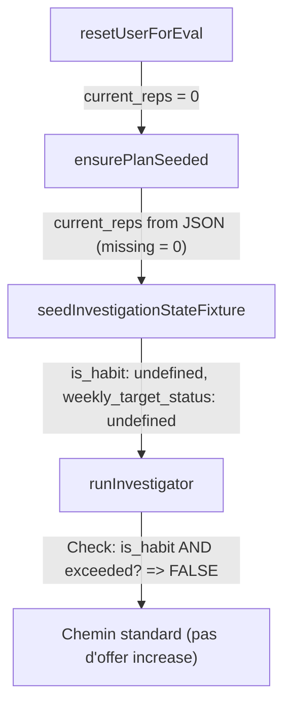

# Plan : Test V4 Target Exceeded Bilan

## Dossier du test

```
frontend/eval/scenarios/bilan_exceed_target/
├── scenario.json           ← Définition du scénario (3 variants: no, yes_no_days, yes_with_days)
├── checklist.md            ← Fiche de vérification (DB reset + post-run + transcript)
├── plan.md                 ← CE fichier
└── commands/
    ├── reset.mjs           ← Reset + validation standalone (peut être lancé indépendamment)
    └── run.sh              ← Commande complète : reset → test → post-run reset
```

## User dédié (slot 6)

| Champ       | Valeur |

|-------------|--------|

| Slot        | 6 |

| Email       | `user-target-exceed-bilan-v4@sophia-test.local` |

| Password    | `SophiaEvalV4!006` |

| User ID     | `7ce005f9-84a1-4f0a-80fa-47651ea80d54` |

| Full name   | `user-target-exceed-bilan-V4` |

| Config file | `frontend/eval/config/eval_fixed_users_staging.json` |

### État DB attendu après reset

| Table | Contenu attendu |

|-------|-----------------|

| **user_actions** | 2 actions actives (Sport 30 min, Lecture 15 min) |

| **user_vital_signs** | 1 signe vital actif (Énergie, /10, counter) |

| **user_chat_states** | mode=investigator, temp_memory={}, investigation_state seedé (3 items) |

| **chat_messages** | vide |

| **user_checkup_logs** | vide |

| **turn_summary_logs** | vide |

| **user_action_entries** | 4 rows (Sport 30 min completed × 4 jours) |

### Détail actions

| Action | type | target_reps | current_reps | scheduled_days (variant) | weekly_target_status |

|--------|------|-------------|--------------|--------------------------|----------------------|

| Sport 30 min | habit | 3 | 4 | null (no, yes_no_days) / ["mon","wed","fri"] (yes_with_days) | exceeded |

| Lecture 15 min | habit | 5 | 2 | null (tous) | below |

### Commandes

```bash
# Reset seul (pour vérifier que la DB est propre)
cd frontend && \
SOPHIA_SUPABASE_URL="http://127.0.0.1:54321" \
SOPHIA_SUPABASE_SERVICE_ROLE_KEY="eyJ..." \
node eval/scenarios/bilan_exceed_target/commands/reset.mjs --variant no

# Run complet (reset → test → post-run reset)
cd frontend && \
bash eval/scenarios/bilan_exceed_target/commands/run.sh no 14
```

### Statut actuel (2026-02-11)

- Variant `no` : ✅ validé sur slot 6 (flow exceeded direct offer + refus + clôture explicite)
- Variant `yes_no_days` : ⏳ à lancer
- Variant `yes_with_days` : ⏳ à lancer

---

## Diagnostic du probleme V3

Le scenario `bilan_target_exceeded_v3_ai_user` ne fonctionne pas correctement. Voici pourquoi :

1. **`seedInvestigationStateFixture`** dans [`run_eval_v2_staging.mjs`](frontend/scripts/run_eval_v2_staging.mjs) (L448-502) ne set **pas** `is_habit` ni `weekly_target_status` sur les `CheckupItem`. Il copie juste `target` et `current` bruts depuis la DB.
2. **`preseed_actions`** dans le JSON V3 ne definit pas `current_reps` (defaut = 0). Donc meme si `preseed_action_entries` logge 4 jours "completed", le champ `current_reps` sur `user_actions` reste a 0.
3. Dans [`investigator/run.ts`](supabase/functions/sophia-brain/agents/investigator/run.ts) (L601-605), le code verifie `currentItem.is_habit && currentItem.weekly_target_status === "exceeded"` — les deux sont `undefined` dans la fixture, donc le chemin "target exceeded" n'est **jamais** emprunte.



## Changements

### 1. Fix global de `seedInvestigationStateFixture`

**Fichier** : [`frontend/scripts/run_eval_v2_staging.mjs`](frontend/scripts/run_eval_v2_staging.mjs) L448-502Modifier le builder de `pendingActions` pour lire `type` (deja dans le select) et calculer :

- `is_habit: String(a.type) === "habit"`
- `weekly_target_status` : compute `"exceeded"` / `"at_target"` / `"below"` selon `current_reps` vs `target_reps`
- `scheduled_days` : copier depuis `user_actions` si present

Ca beneficie tous les scenarios existants et futurs, pas seulement V4.

### 2. Implementer le flow `scheduled_days` dans l'increase target

Actuellement, `increaseWeekTarget` fait un simple `target_reps + 1` sans toucher `scheduled_days`. Le flow complet a implementer :**Quand `scheduled_days` n'est PAS defini (ou vide)** — comportement actuel, deja en place :

- User dit oui → `increaseWeekTarget` fait `target_reps + 1` → fini.

**Quand `scheduled_days` EST defini (ex: `["mon","wed","fri"]`)** — nouveau flow a implementer :

- User dit oui → au lieu d'appeler `increaseWeekTarget` immediatement, Sophia demande quel jour ajouter.
- User repond avec un jour (ex: "le mardi").
- Sophia parse le jour, appelle `increaseWeekTarget` avec le jour supplementaire → `target_reps + 1` ET `scheduled_days` passe de `["mon","wed","fri"]` a `["mon","tue","wed","fri"]`.

#### 2a. Modifier `increaseWeekTarget` dans `db.ts`

**Fichier** : [`supabase/functions/sophia-brain/agents/investigator/db.ts`](supabase/functions/sophia-brain/agents/investigator/db.ts) L544-590Ajouter un parametre optionnel `dayToAdd?: string` a la signature. Si fourni :

- Lire `scheduled_days` actuel depuis la DB.
- Ajouter `dayToAdd` a la liste (sans doublon).
- Faire l'update avec `{ target_reps: newTarget, scheduled_days: newDays }` au lieu de juste `{ target_reps: newTarget }`.

Si `dayToAdd` n'est pas fourni, le comportement reste identique a l'actuel (+1 seulement).

#### 2b. Ajouter le stage `awaiting_day_choice` dans `run.ts`

**Fichier** : [`supabase/functions/sophia-brain/agents/investigator/run.ts`](supabase/functions/sophia-brain/agents/investigator/run.ts) L379-420Le flow `bilan_defer_offer` a actuellement un seul stage : `"awaiting_consent"`. Ajouter un second stage `"awaiting_day_choice"` :

1. Dans le handler de `pendingOffer.kind === "increase_target"` quand `userSaysYes` (L410-420) :

- Verifier si `pendingOffer.has_scheduled_days === true`.
- Si oui : au lieu d'appeler `increaseWeekTarget`, generer un message via `investigatorSay("increase_target_ask_day", ...)` qui demande quel jour, et retourner avec un nouveau state ou `bilan_defer_offer.stage = "awaiting_day_choice"`.
- Si non : appeler `increaseWeekTarget` comme actuellement (pas de changement).

2. Ajouter un nouveau bloc AVANT le handler `awaiting_consent` (ou juste apres) pour gerer `pendingOffer.stage === "awaiting_day_choice"` :

- Parser le jour depuis le message user (utiliser un parsing comme dans `parseExplicitUpdateActionFromUserMessage` qui mappe "lundi" → "mon", etc.).
- Appeler `increaseWeekTarget(supabase, userId, offerItemId, parsedDay)`.
- Continuer le bilan normalement.

#### 2c. Ajouter `has_scheduled_days` dans le `bilan_defer_offer` stocke (L624-638)

Dans le bloc ou `bilan_defer_offer` est cree (L624-638), ajouter le champ :

```javascript
has_scheduled_days: Array.isArray(currentItem.scheduled_days) && currentItem.scheduled_days.length > 0,
current_scheduled_days: currentItem.scheduled_days ?? [],
```

#### 2d. Ajouter le scenario `investigatorSay("increase_target_ask_day", ...)` dans `copy.ts`

**Fichier** : [`supabase/functions/sophia-brain/agents/investigator/copy.ts`](supabase/functions/sophia-brain/agents/investigator/copy.ts)Ajouter un scenario `"increase_target_ask_day"` dans les conditions de `investigatorSay`. Le prompt doit :

- Confirmer que le user veut augmenter.
- Lister les jours deja occupes (en francais).
- Demander quel jour supplementaire il veut. Ex : "Ok ! Aujourd'hui tu fais lundi, mercredi et vendredi. Tu voudrais rajouter quel jour ?"

### 3. Creer le scenario V4 avec trois variants

**Fichier** : `frontend/eval/scenarios/tools/target-exceed-bilan-V4.json`Un seul JSON avec `variants: [{ id: "yes_no_days", ... }, { id: "yes_with_days", ... }, { id: "no", ... }]` :

- **`yes_no_days`** : user accepte d'augmenter, action SANS `scheduled_days` → +1 simple
- **`yes_with_days`** : user accepte d'augmenter, action AVEC `scheduled_days: ["mon","wed","fri"]` → Sophia demande quel jour → user choisit "mardi" → +1 ET ajout du jour
- **`no`** : user refuse d'augmenter → rien ne change

Setup commun a tous les variants :

- `setup.preseed_vitals` : 1 signe vital (ex: "Humeur" ou "Energie") pour que le bilan ait un item vital a traiter en premier
- `setup.preseed_actions` :
- "Lecture 15 min" : `type: "habit"`, `target_reps: 5`, `current_reps: 2` (= below, flow normal)
- `setup.preseed_action_entries` : 4 jours completed pour l'action exceeded

Setup specifique par variant :

- **`yes_no_days`** et **`no`** :
- "Sport 30 min" : `type: "habit"`, `target_reps: 3`, `current_reps: 4`, **pas de `scheduled_days`**
- **`yes_with_days`** :
- "Sport 30 min" : `type: "habit"`, `target_reps: 3`, `current_reps: 4`, `scheduled_days: ["mon","wed","fri"]`

Invocation :

```bash
--scenario target-exceed-bilan-V4 --variant yes_no_days
--scenario target-exceed-bilan-V4 --variant yes_with_days
--scenario target-exceed-bilan-V4 --variant no
```

### 4. Ajouter les 3 variants dans simulate-user

**Fichier** : [`supabase/functions/simulate-user/index.ts`](supabase/functions/simulate-user/index.ts) L1874-1907Ajouter trois cases dans le `switch (variant)` de `buildBilanV3StateMachineContext` :

- `case "target_exceeded_yes_no_days"` :
- Stage 0 : "On peut faire mon bilan maintenant ?"
- Stage 1 : Repond au signe vital
- Stage 2 : Reagit aux felicitations + accepte l'augmentation ("Oui carrement, on augmente !")
- Stage 3 : Repond a l'action 2
- Stage 4 : Accuse reception fin bilan
- `case "target_exceeded_yes_with_days"` :
- Stage 0 : "On peut faire mon bilan maintenant ?"
- Stage 1 : Repond au signe vital
- Stage 2 : Reagit aux felicitations + accepte l'augmentation ("Oui on augmente")
- Stage 3 : Repond avec un jour precis ("Le mardi" ou "Mardi ca me va")
- Stage 4 : Repond a l'action 2
- Stage 5 : Accuse reception fin bilan
- `case "target_exceeded_no"` :
- Stage 0 : "On peut faire mon bilan maintenant ?"
- Stage 1 : Repond au signe vital
- Stage 2 : Refuse l'augmentation ("Non je reste comme ca, ca me va")
- Stage 3 : Repond a l'action 2
- Stage 4 : Accuse reception fin bilan

Le premier message user sera force a "On peut faire mon bilan maintenant ?" (stage 0).

### 5. Ajouter le user V4 dedie

**Fichier** : [`frontend/eval/config/eval_fixed_users_staging.json`](frontend/eval/config/eval_fixed_users_staging.json)Ajouter un slot 6 :

```json
{
  "slot": 6,
  "email": "user-target-exceed-bilan-v4@sophia-test.local",
  "password": "SophiaEvalV4!006",
  "full_name": "user-target-exceed-bilan-V4"
}
```

Puis provisionner via `provision_eval_v2_users.mjs`.

### 6. Exporter l'investigation_state initial dans le bundle

**Fichier** : [`frontend/scripts/run_eval_v2_staging.mjs`](frontend/scripts/run_eval_v2_staging.mjs) L758-990Apres le seed et avant l'invoke de run-evals (entre L769 et L772) :

- Lire `investigation_state` depuis `user_chat_states`
- Sauvegarder dans le bundle en tant que `investigation_state_initial.json`

### 7. Reset explicite post-run

Le flow actuel (`resetUserForEval` + `ensurePlanSeeded` en debut de run) restaure deja l'etat. Mais pour la tranquillite :

- Apres l'export du bundle, appeler `resetUserForEval` + `ensurePlanSeeded` pour remettre le user a son etat initial.
- Cela garantit que `target_reps` revient a 3 et `scheduled_days` revient a son etat initial (meme si `increaseWeekTarget` a modifie les deux pendant le run).

---

## Rappel : structure du bilan dans ce scenario

Ce test simule un **vrai bilan complet**. L'investigation_state contient :

- **1 signe vital** (ex : Humeur, Energie, Sommeil)
- **2 actions** :
- Action 1 : "Sport 30 min" — `type: "habit"`, `target_reps: 3`, `current_reps: 4` (= **exceeded**)
- Action 2 : "Lecture 15 min" — `type: "habit"`, `target_reps: 5`, `current_reps: 2` (= **below**, flow normal)

Le bilan se deroule dans l'ordre des `pending_items`. Le signe vital passe en premier, puis les actions. Ce n'est qu'au moment ou Sophia arrive a l'action exceeded qu'elle propose l'augmentation. **Pas avant.**Le scenario peut durer jusqu'a **14 turns**. Sophia est libre d'utiliser 1 ou 2 messages pour chaque sujet si elle en a besoin (clarifier, rebondir, etc). On ne verrouille PAS le contenu a un turn precis.

### Les 3 variants et leur flow attendu

#### Variant `yes_no_days` — Accept increase, pas de jours definis

L'action exceeded n'a PAS de `scheduled_days`. Flow :

1. Sophia arrive a l'action exceeded → felicite → propose d'augmenter (+1).
2. User dit oui.
3. Sophia appelle `increaseWeekTarget` → `target_reps` passe de 3 a 4.
4. Sophia confirme et continue le bilan.

#### Variant `yes_with_days` — Accept increase, jours definis

L'action exceeded A des `scheduled_days: ["mon","wed","fri"]`. Flow :

1. Sophia arrive a l'action exceeded → felicite → propose d'augmenter (+1).
2. User dit oui.
3. Sophia detecte que des jours sont definis → demande **quel jour** ajouter (ex: "Tu fais deja lundi, mercredi et vendredi. Tu voudrais rajouter quel jour ?").
4. User repond avec un jour (ex: "Le mardi").
5. Sophia parse "mardi" → "tue", appelle `increaseWeekTarget(actionId, "tue")` → `target_reps` passe de 3 a 4 ET `scheduled_days` passe de `["mon","wed","fri"]` a `["mon","tue","wed","fri"]`.
6. Sophia confirme et continue le bilan.

Ce variant est plus long que `yes_no_days` (1 echange supplementaire pour le choix du jour).

#### Variant `no` — Refuse increase

L'action exceeded n'a PAS de `scheduled_days` (le setup est le meme que `yes_no_days`). Flow :

1. Sophia arrive a l'action exceeded → felicite → propose d'augmenter.
2. User dit non.
3. Sophia accepte, ne touche a rien, continue le bilan.

### Comportement general pour `increase_target`

Quand Sophia arrive a l'action dont `weekly_target_status === "exceeded"` :

1. Elle **felicite** (brievement, c'est une victoire reelle).
2. Elle **propose d'augmenter l'objectif** d'elle-meme (c'est a son initiative, pas celle du user).

- Formulation type : "Je reviens vers toi par rapport a [action], est-ce que tu veux qu'on augmente le nombre de repetitions pour la semaine ?"

3. Le user repond oui ou non.

**Si oui — logique selon `scheduled_days`** :

- Si `scheduled_days` n'est **PAS defini** (ou vide) : on ajoute simplement +1 a `target_reps`. Terminé.
- Si `scheduled_days` **est defini** (ex: `["mon","wed","fri"]`) : Sophia demande **quel jour** ajouter la repetition supplementaire. Le user repond avec un jour. Sophia ajoute le jour a `scheduled_days` ET incremente `target_reps` de 1.

**Si non** : on ne touche a rien, on continue le bilan.---

## Protocole de verification des tests (a injecter dans l'agent de validation)

Cette section decrit ce que l'agent qui lance et valide les tests doit verifier. L'analyse ne doit **PAS** etre rigide tour par tour : Sophia peut prendre 1 ou 2 messages pour traiter un sujet. L'important est que certains **evenements/phases** apparaissent QUELQUE PART dans la conversation, dans le bon ordre. Le scenario peut aller jusqu'a 14 turns.Chaque run produit un bundle dans `tmp/bundles_v2/`. L'agent doit ouvrir et analyser 4 fichiers : `run_evals_response.json`, `investigation_state_initial.json`, `conversation_transcript.txt`, `brain_trace.jsonl`.

### Etape A : Verification mecanique (run_evals_response.json)

Ouvrir `run_evals_response.json` et verifier :

1. `results[0].scenario_key `contient bien `target-exceed-bilan-V4` (et le variant attendu dans l'id).
2. `results[0].issues_count === 0` — tout issue > 0 est un echec, lire le detail dans `results[0].issues` pour comprendre.
3. `results[0].bilan_completed === true `— si false, le bilan ne s'est pas cloture proprement. Cause probable : boucle infinie de clarification (`resolveBinaryConsent` retourne null), ou investigator bloque.
4. `results[0].turns_executed >= 5` — un run trop court (1-3 turns) signifie que le bilan n'a pas eu lieu (meme bug que V3 : le mode reste "companion" au lieu de "investigator"). Rappel : il y a 1 vital + 2 actions a traiter, donc minimum 5-6 echanges.
5. `stopped_reason === null` — si non-null, le run s'est interrompu (timeout, erreur).

Si un de ces checks echoue, ne pas continuer aux etapes suivantes. Diagnostiquer d'abord.

### Etape B : Verification de l'investigation_state initial (investigation_state_initial.json)

Ce fichier est la preuve que le seeding a fonctionne correctement. Verifier :

1. `status === "checking"` — si "init", le fixture n'a pas ete applique.
2. `pending_items` contient exactement **3 items** : 1 vital + 2 actions.
3. Identifier le signe vital :

- `type === "vital"`.
- Il doit etre present et avoir un titre coherent (ex: "Humeur", "Energie", "Sommeil").

4. Identifier l'action exceeded (ex: "Sport 30 min") :

- `type === "action"`.
- `is_habit === true` — si absent ou false, le fix de `seedInvestigationStateFixture` n'a pas ete applique. C'est le bug V3. Verifier le code L471-479 de `run_eval_v2_staging.mjs`.
- `weekly_target_status === "exceeded"` — si absent, "below", ou "at_target", le `current_reps` n'a pas ete seede correctement. Verifier que le scenario JSON a bien `current_reps: 4` dans preseed_actions et que `ensurePlanSeeded` l'ecrit en DB.
- `target === 3` et `current === 4` — les valeurs brutes doivent correspondre au scenario.
- **Variant `yes_no_days` et `no`** : `scheduled_days` doit etre absent ou vide.
- **Variant `yes_with_days`** : `scheduled_days` doit etre `["mon","wed","fri"]` (3 jours definis).

5. Identifier l'action normale (ex: "Lecture 15 min") :

- `is_habit === true`.
- `weekly_target_status === "below"` (current_reps: 2 < target_reps: 5).

6. `current_item_index === 0` — le bilan commence bien par le premier item.

Si `is_habit` ou `weekly_target_status` manquent sur les actions, le fix de la fixture (etape 1 du plan) n'a pas ete applique. C'est la cause racine de l'echec V3. Ne pas aller plus loin.

### Etape C : Verification du transcript (conversation_transcript.txt)

Lire le transcript en entier. Chaque bloc est un `[timestamp] [web] user/assistant`. On ne verifie **PAS** a quel numero de tour chaque chose se passe (Sophia peut prendre plus ou moins de messages). On verifie que les **phases** suivantes apparaissent, dans l'ordre, quelque part dans la conversation.

#### Phase 1 : Declenchement du bilan

- Le premier message user doit etre une demande de bilan (variante de "On peut faire mon bilan maintenant ?").
- La premiere reponse assistant doit indiquer que le bilan demarre. Sophia lance le bilan et commence par le premier item (typiquement le signe vital).
- **Alerte** : si l'assistant repond en mode "companion" (pas de question sur le vital, pas de demarrage de bilan), l'investigation state n'a pas ete seedee.

#### Phase 2 : Traitement du signe vital

- QUELQUE PART dans les premiers echanges, Sophia doit poser une question sur le signe vital (ex: "Comment tu te sens niveau energie ?" / "Tu as dormi combien d'heures ?").
- Le user simule repond avec une valeur.
- Sophia accuse reception et passe a la suite.
- **Alerte** : si le signe vital n'est jamais aborde, verifier l'ordre des `pending_items` dans l'investigation_state_initial.

#### Phase 3 : Arrivee a l'action exceeded — Felicitation + Proposition

C'est le coeur du test. QUELQUE PART apres le vital, Sophia doit arriver a l'action exceeded (ex: "Sport 30 min") et :

- **DOIT** : feliciter le user (bravo, super, bien joue, chapeau, nice, objectif atteint, etc.). La felicitation doit etre naturelle et chaleureuse, pas robotique.
- **DOIT** : proposer d'augmenter l'objectif. C'est **a l'initiative de Sophia**, pas du user. Formulations acceptables : "Tu veux qu'on passe a 4 fois par semaine ?", "On augmente l'objectif ?", "Tu veux qu'on monte la barre ?", etc. Le chiffre cible (4, ou `target + 1`) devrait etre mentionne.
- **INTERDIT** : demander "tu l'as fait ?" / "c'est fait ?" pour l'action exceeded. L'objectif est deja depasse, poser cette question est un echec **grave** qui signifie que le code path "target exceeded" dans `investigator/run.ts` L601-605 n'a pas ete emprunte. Si ca arrive, revenir a l'etape B et verifier `is_habit` et `weekly_target_status`.
- **Alerte** : si Sophia saute directement a l'action 2 sans feliciter ni proposer d'augmenter, le `weekly_target_status` n'est pas "exceeded" ou le random a filtre l'action. Verifier l'investigation_state_initial.

#### Phase 4 : Reponse du user a la proposition d'augmentation

- **Variants `yes_no_days` et `yes_with_days`** : le message user doit contenir un mot affirmatif clair parmi : oui, ouais, ok, okay, d'accord, dac, vas-y, go, carre, yep, yes. Reference : regex `isAffirmative` dans `investigator/utils.ts` L9-13.
- **Variant `no`** : le message user doit contenir un mot negatif clair parmi : non, nope, nan, laisse, pas besoin, pas maintenant, stop, on laisse, plus tard. Reference : regex `isNegative` dans `investigator/utils.ts` L16-21.
- **INTERDIT** (pour tous) : contenir a la fois un mot affirmatif ET un mot negatif (ex: "oui mais pas maintenant"). `resolveBinaryConsent` retourne `null` dans ce cas et le bilan entre en boucle de clarification.
- **Alerte** : si le message user est ambigu, c'est un probleme dans le simulate-user (stage correspondant du state machine). Verifier que le `stageInstruction` du variant guide bien vers un message sans ambiguite.

#### Phase 4b (variant `yes_with_days` uniquement) : Sophia demande quel jour

Ce phase n'existe QUE pour le variant `yes_with_days`. Elle se place entre la reponse oui du user et la confirmation finale.

- Sophia doit demander quel jour ajouter. Chercher : mention des jours existants (lundi/mercredi/vendredi ou mon/wed/fri) et une question sur le jour supplementaire.
- Le user repond avec un jour precis (ex: "Le mardi", "Mardi"). Le message doit contenir un jour de la semaine sans ambiguite.
- **Alerte** : si Sophia ne demande pas le jour et fait directement le +1 sans toucher `scheduled_days`, le code du stage `awaiting_day_choice` dans `run.ts` n'est pas actif. Verifier que `has_scheduled_days` est bien set dans le `bilan_defer_offer`.
- **Alerte** : si le parsing du jour echoue (Sophia re-demande ou ignore), verifier le parser de jours dans `run.ts`.

#### Phase 5 : Confirmation / Refus et enchainement

**REGLE CRITIQUE — coherence message/outil** : Sophia ne doit **JAMAIS** confirmer l'augmentation au user si le tool `increaseWeekTarget` n'a pas ete appele avec succes. Le message de confirmation doit etre genere APRES reception du resultat du tool (`success: true`). Si le tool echoue (`success: false` ou erreur), Sophia doit signaler l'echec ("pas pu augmenter", "souci technique") et NE PAS dire que c'est fait.Pour verifier : croiser le transcript (ce que Sophia dit) avec la trace (ce que le tool a retourne). Si Sophia dit "c'est passe a 4×/semaine" mais que la trace ne montre aucun appel `increaseWeekTarget`, ou montre un appel avec `success: false`, c'est un **echec grave** (Sophia ment au user). C'est le check le plus important de cette phase.

- **Variant `yes_no_days`** :
- La trace DOIT montrer un appel `increaseWeekTarget` avec `success: true`, `old_target: 3`, `new_target: 4` AVANT que Sophia envoie le message de confirmation.
- Le message de confirmation DOIT mentionner l'augmentation. Chercher : "fait", "augmente", "passe a 4", "objectif", "4 fois", "4x", "c'est bon".
- Si le tool a echoue (visible dans la trace), le message de Sophia NE DOIT PAS confirmer. Chercher : "souci", "pas pu", "erreur", "technique".
- **Variant `yes_with_days`** :
- Meme regle : la trace DOIT montrer un appel `increaseWeekTarget` avec `success: true` (et idealement le `dayToAdd` visible) AVANT le message de confirmation.
- Le message de confirmation DOIT mentionner l'augmentation ET le jour ajoute (ex: "mardi ajoute", "c'est note pour le mardi", "objectif passe a 4 avec le mardi en plus").
- Si le tool a echoue, meme logique que ci-dessus : pas de confirmation trompeuse.
- **Variant `no`** :
- Sophia doit indiquer qu'on garde l'objectif actuel. Chercher : "garde", "actuel", "ok", "pas de souci", "d'accord", "on laisse".
- INTERDIT : mentionner une augmentation alors que le user a refuse.
- La trace NE DOIT PAS contenir d'appel a `increaseWeekTarget`.
- Dans les **TROIS** cas : Sophia doit enchainer sur le reste du bilan (l'action 2 ou la cloture). Si elle s'arrete la, c'est un bug.
- **Alerte** : si Sophia repose la meme question d'augmentation, le `bilan_defer_offer` n'a pas ete nettoye dans temp_memory. Bug dans `run.ts` L444 (`delete nextTempMemory.bilan_defer_offer`).

#### Phase 6 : Traitement de l'action 2 (flow normal)

- Sophia doit poser la question sur l'action 2 (ex: "Lecture 15 min") : "c'est fait ?", "tu l'as fait ?".
- Le user repond.
- Sophia accuse reception.
- C'est un flow standard d'action below, rien de special a verifier a part que la conversation reste fluide.

#### Phase 7 : Cloture du bilan

- Sophia doit clore le bilan avec un message de fin (recapitulatif, encouragement, etc.).
- Le bilan doit etre marque comme termine (`bilan_completed: true` dans les metriques).
- Apres la cloture, le mode doit repasser en "companion".

#### Verification globale du transcript (a faire sur TOUT le transcript)

Ces verifications portent sur la qualite conversationnelle globale, pas sur une phase precise :

- **Alternance user/assistant** : pas de tours consecutifs du meme role (deux messages user d'affilee, ou deux messages assistant d'affilee).
- **Pas de message vide** (content = "").
- **Pas de repetition mot-pour-mot** entre deux messages assistant differents.
- **Nombre total de turns coherent** : attendu 6-14 turns pour ce scenario (1 vital + 2 actions + proposition increase + reponse + cloture). Moins de 5 = le bilan n'a probablement pas eu lieu. Plus de 14 = boucle ou digression infinie.
- **Tutoiement partout** : Sophia tutoie le user ("tu", "toi", pas "vous").
- **Feminin pour Sophia** : "je suis contente", "je suis prete", "je suis ravie" (pas "content", "pret", "ravi").
- **Emojis** : 1-2 emojis par message max, minimum 1. Pas d'exces.
- **INTERDIT** : gras/markdown (`**`), salutations ("bonjour", "salut"), termes techniques ("log", "database", "tool", "JSON", "variable").
- **Coherence conversationnelle** : les messages doivent s'enchainer naturellement. Si Sophia dit "super" puis enchaine sur un sujet totalement different sans transition, c'est un probleme de flow. La conversation doit donner l'impression d'un echange humain, pas d'un robot qui defile une checklist.
- **Pas de "topic hop"** : Sophia ne doit pas soudainement parler d'un sujet hors-bilan en plein milieu (signe d'une transition parasite vers `topic_serious` ou `topic_light`).

### Etape D : Verification de la trace (brain_trace.jsonl)

Chaque ligne est un JSON avec `ts_db` et `payload`. Parcourir toutes les lignes et verifier les points suivants. Comme pour le transcript, on ne cible **PAS** des numeros de turn precis — on cherche des evenements.

#### Sur le premier turn (premier message user → reponse assistant)

1. `brain:dispatcher_result` : `target_mode === "investigator"`. Si `target_mode === "companion"`, le bilan n'a pas ete detecte. Verifier le seeding de l'investigation state.
2. `state_flags.checkup_active === true`. Si false, l'investigation state n'a pas ete seedee.
3. Verifier qu'il n'y a PAS de `machine_transition` vers `topic_serious` ou `topic_light` (le guard du router doit les bloquer pendant le bilan).

#### Sur le turn ou Sophia propose l'augmentation

4. Le turn doit etre en mode `investigator` (pas de basculement intempestif vers `companion`).
5. Le `currentItem` traite doit etre l'action exceeded (verifier via l'action_id ou le titre dans les events de la trace).

#### Sur le(s) turn(s) ou le user repond a la proposition d'augmentation

6. **Variant `yes_no_days`** : chercher un appel a `increaseWeekTarget` dans la trace. Le resultat doit indiquer `success: true`, `old_target: 3`, `new_target: 4`. Si absent, l'augmentation n'a pas eu lieu en DB — c'est un echec.
7. **Variant `yes_with_days`** : l'appel a `increaseWeekTarget` doit apparaitre APRES le turn ou le user donne le jour (pas immediatement apres le "oui"). Le resultat doit indiquer `success: true`, `old_target: 3`, `new_target: 4`. Verifier aussi que `scheduled_days` a ete mis a jour (si visible dans la trace).
8. **Variant `no`** : aucun appel a `increaseWeekTarget` ne doit apparaitre. Si un tool call apparait, c'est un bug.
9. `brain:agent_done` : `next_mode === "investigator"` (le bilan continue avec l'action 2). Si `next_mode === "companion"`, le bilan s'est interrompu trop tot.

#### Sur tous les turns

10. Tous les turns doivent avoir `target_mode === "investigator"` dans `brain:dispatcher_result` (sauf le tout dernier qui peut marquer la fin).
11. Aucun `machine_transition` vers `topic_serious` ou `topic_light` ne doit apparaitre pendant que `checkup_active === true`.
12. Le dernier turn doit avoir `next_mode === "companion"` dans `brain:agent_done` (fin du bilan).
13. `state_flags.checkup_active` doit passer a `false` sur le dernier turn.

### Etape E : Verification post-run (etat DB)

Apres le run mais avant le reset, verifier l'etat de la DB si possible :

- **Variant `yes_no_days`** : `user_actions` pour "Sport 30 min" doit avoir `target_reps === 4` (augmente de 3 a 4). `scheduled_days` doit rester absent/vide (pas de changement).
- **Variant `yes_with_days`** : `user_actions` pour "Sport 30 min" doit avoir `target_reps === 4` ET `scheduled_days` doit contenir 4 jours (ex: `["mon","tue","wed","fri"]` si le user a choisi mardi). Si `scheduled_days` est toujours a 3 jours, l'ajout du jour n'a pas fonctionne.
- **Variant `no`** : `user_actions` pour "Sport 30 min" doit avoir `target_reps === 3` (inchange). `scheduled_days` inchange.
- `investigation_state` dans `user_chat_states` doit etre `null` ou absente (le bilan est cloture et l'etat a ete nettoyee).

Apres le reset :

- `target_reps` doit etre revenu a 3 (pour les trois variants).
- `current_reps` doit etre revenu a 4 (re-seede depuis le scenario JSON).
- `scheduled_days` doit etre revenu a son etat initial (`["mon","wed","fri"]` pour `yes_with_days`, absent pour les autres).

### Etape F : Criteres de rerun / fix (par priorite)

Si un check echoue, voici la priorite de diagnostic — commencer par le haut :

1. **`is_habit` ou `weekly_target_status` absent dans investigation_state_initial.json** : le fix de `seedInvestigationStateFixture` n'est pas applique. Priorite maximale. Fichier : `run_eval_v2_staging.mjs` L471-479.
2. **Sophia demande "tu l'as fait ?" / "c'est fait ?" pour l'action exceeded** : meme cause que 1 — le code path "target exceeded" dans `investigator/run.ts` L601-605 n'est pas emprunte. Verifier l'investigation_state_initial.
3. **Sophia ne propose jamais d'augmenter** : l'action exceeded n'est peut-etre pas dans les `pending_items` (filtree par le random a L241 de `db.ts`). Dans le fixture, ce random doit etre force/bypasse pour que l'action exceeded soit toujours presente.
4. **Mode companion au lieu de investigator** : l'investigation state n'a pas ete seedee. Verifier `seedInvestigationStateFixture` et `ensurePlanSeeded`.
5. **`resolveBinaryConsent` retourne null (boucle de clarification)** : le message user est ambigu. Fixer le `stageInstruction` dans `simulate-user/index.ts` pour forcer un message clair (oui/non sans ambiguite).
6. **`increaseWeekTarget` echoue (variants yes)** : verifier que l'action_id dans `bilan_defer_offer` correspond bien a l'action "Sport 30 min" en DB. Le fixture pourrait utiliser un id qui ne match pas.

6b. **Sophia confirme l'augmentation mais le tool a echoue ou n'a pas ete appele** : c'est un echec critique de coherence. Croiser le transcript (message de confirmation) avec la trace (resultat du tool). Si le transcript dit "c'est passe a 4" mais que la trace montre `success: false` ou aucun appel, le code genere le message de confirmation AVANT ou SANS verifier le resultat du tool. Bug dans `run.ts` L456-458 (le prefix est construit conditionnellement sur `increaseResult?.success`).

7. **Variant `yes_with_days` : Sophia ne demande pas quel jour** : verifier que `has_scheduled_days: true` est bien set dans le `bilan_defer_offer` (L624-638 de `run.ts`). Verifier que le stage `awaiting_day_choice` est implemente. Verifier que `scheduled_days` est bien present sur le `currentItem` dans l'investigation_state_initial.
8. **Variant `yes_with_days` : le parsing du jour echoue** : le user a donne un jour mais Sophia ne l'a pas compris. Verifier le parser de jours dans `run.ts` (mapping "lundi"→"mon", "mardi"→"tue", etc.). Le mapping doit etre le meme que dans `parseExplicitUpdateActionFromUserMessage` de `architect/handle_model_output.ts`.
9. **Variant `yes_with_days` : `scheduled_days` pas mis a jour en DB** : `increaseWeekTarget` n'a pas recu le parametre `dayToAdd` ou n'a pas fait l'update. Verifier `db.ts`.
10. **Le bilan ne se cloture pas** : verifier `turns_executed` et le nombre de pending_items. Si l'action 2 n'est pas traitee, il manque peut-etre un stage dans le state machine simulate-user.
11. **Topic hop pendant le bilan** : un `machine_transition` vers `topic_serious` apparait dans la trace. Le guard dans `router/run.ts` n'est pas actif. Verifier la condition `bilanActive`.
12. **Repetition de la proposition d'augmentation** : `bilan_defer_offer` n'est pas supprime apres traitement. Bug dans `run.ts` L444 (`delete nextTempMemory.bilan_defer_offer`).
13. **Le signe vital n'est jamais traite** : verifier l'ordre des `pending_items` et que le vital est bien present dans l'investigation_state_initial.
14. **Incoherence conversationnelle** (repetitions, ton robotique, "tu l'as fait" alors que c'est deja fait, etc.) : ces problemes sont souvent lies au prompt de l'investigator (`copy.ts` scenarios ou `prompt.ts` addons). Analyser quel scenario `investigatorSay` est appele et si le prompt est adequate.

### Etape G : Comparaison entre les 3 variants

Si les trois variants ont ete lances, comparer :

1. Les trois variants doivent avoir `bilan_completed === true` et `issues_count === 0`.
2. Les phases 1-3 (declenchement bilan, vital, arrivee a l'action exceeded + felicitation + proposition) doivent etre **quasi-identiques** entre les trois variants. C'est a partir de la phase 4 (reponse user) que les transcripts divergent.
3. Les variants `yes_no_days` et `yes_with_days` doivent avoir un appel `increaseWeekTarget` reussi dans la trace. Le variant `no` ne doit PAS en avoir.
4. Le `target_reps` final en DB doit etre 4 pour les deux variants "yes" et 3 pour `no`.
5. Le variant `yes_with_days` doit avoir `scheduled_days` avec 4 jours (vs 3 initialement). Les deux autres variants ne doivent pas modifier `scheduled_days`.
6. Le variant `yes_with_days` est le plus long (1-2 turns de plus que `yes_no_days` a cause de la question sur le jour).